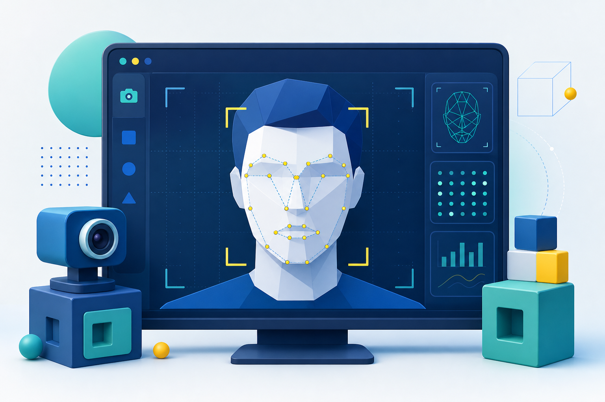

# Détection de visage avec OpenCV

Cette application C++ permet de détecter des visages en temps réel depuis une webcam, une image ou une vidéo grâce à OpenCV.
La version modernisée utilise YuNet, un modèle officiel d'OpenCV Zoo, afin d'améliorer la précision, la détection de plusieurs visages et la robustesse face aux variations de pose et d'éclairage.

L'interface affiche les visages détectés avec un rectangle, un score de confiance, le centre du visage et les principaux repères faciaux. Elle permet aussi de prendre une capture manuelle, de flouter ou de pixeliser les visages, et de suivre les performances avec un compteur de FPS.

Le projet conserve également une démonstration historique utilisant les cascades Haar afin de comparer les deux approches.

## Haar vs YuNet

- Haar : approche historique, légère, utile pour comprendre les cascades classiques.
- YuNet : modèle moderne fourni par OpenCV Zoo, plus robuste et capable de fournir cinq repères faciaux.

L'ancien code Haar est conservé dans `legacy/detecteFace_haar.cpp`.

## Fonctionnalités

- Webcam, image ou vidéo en entrée.
- Détection de plusieurs visages.
- Rectangle, score, centre du visage et cinq points faciaux YuNet.
- Compteur de visages.
- FPS moyen glissant.
- Capture manuelle avec la touche `S`.
- Floutage des visages avec `--blur` ou touche `B`.
- Pixelisation avec `--pixelate`.
- Pause avec `P`, aide avec `H`, sortie avec `Q` ou `Esc`.
- Lissage temporel simple des rectangles.
- Mode pédagogique `--legacy-haar`.

## Prérequis

- CMake 3.16+
- Compilateur C++17
- OpenCV avec le module `objdetect`
- Modèle YuNet OpenCV Zoo

## Installation Ubuntu

```bash
sudo apt-get update
sudo apt-get install -y build-essential cmake libopencv-dev
```

## Installation Windows

Vous pouvez installer OpenCV avec vcpkg :

```powershell
vcpkg install opencv4
```

Ou utiliser une version OpenCV précompilée, puis configurer `OpenCV_DIR` avant CMake.

## Modèle YuNet officiel

Télécharger le modèle officiel depuis OpenCV Zoo :

```text
https://github.com/opencv/opencv_zoo/tree/main/models/face_detection_yunet
```

Placer le fichier ici :

```text
models/face_detection_yunet_2023mar.onnx
```

Le modèle n'est pas inclus dans ce dépôt.

## Compilation

```bash
cmake -S . -B build
cmake --build build --config Release
```

## Utilisation

```bash
./build/face_detection --camera 0 --mirror
./build/face_detection --model models/face_detection_yunet_2023mar.onnx
./build/face_detection --blur
./build/face_detection --pixelate
./build/face_detection --image path/to/image.jpg
./build/face_detection --video path/to/video.mp4
```

## Options

```text
--camera 0
--model chemin_du_modele.onnx
--confidence 0.85
--width 1280
--height 720
--mirror
--blur
--pixelate
--snapshot-dir chemin
--image chemin
--video chemin
--legacy-haar
--help
```

## Raccourcis clavier

- `S` : enregistrer une capture horodatée.
- `B` : activer ou désactiver le floutage.
- `P` : pause / reprise.
- `H` : afficher l'aide.
- `Q` ou `Esc` : quitter.

## Structure

```text
src/
  main.cpp
  FaceDetector.cpp
  FaceDetector.hpp
legacy/
  detecteFace_haar.cpp
models/
  README.md
docs/screenshots/
```

## Illustration

Illustration de l'application de détection de visage avec OpenCV et YuNet :



## Confidentialité

Le programme localise des visages mais n'identifie pas les personnes. Il n'ajoute pas de reconnaissance d'identité, ne constitue pas de base biométrique et n'enregistre pas automatiquement d'image. Les captures sont déclenchées manuellement par l'utilisateur.

## Limites

- YuNet nécessite un modèle ONNX téléchargé séparément.
- La précision dépend de la caméra, de l'éclairage et de la résolution.
- Le suivi est volontairement léger et ne remplace pas un vrai tracker multi-objet.

## Extension possible : Face Landmarker

MediaPipe Face Landmarker pourrait fournir un maillage facial détaillé, des expressions faciales, des effets ou filtres et un suivi plus précis des traits. Il n'est pas ajouté comme dépendance obligatoire afin de garder ce projet C++ léger et facile à compiler.

## Licence

Licence à clarifier.
